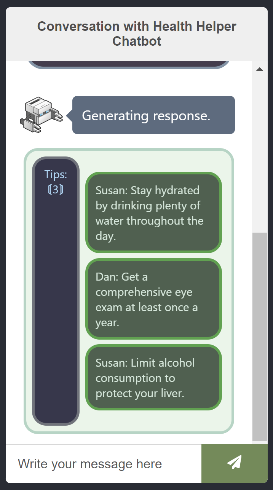

# Health Helper Chatbot

Interactive chatbot with NLU utility to generate human-like responses, and MongoDB database to store insights on user health.

### Installation

Clone the repository:

```
https://github.com/danmxli/health-helper-chatbot
```

##### Start the NLU utility server

open a terminal. Navigate to the `data/language_models` directory, and run `node trainer.js`

##### Start the API

ensure you have a [mongoDB account](https://www.mongodb.com/)

open a terminal. Navigate to the `data/mongodb` directory, and replace the uri with your own:

```
const { MongoClient, ServerApiVersion } = require('mongodb');
const uri = "your-own-uri";
```

navigate to the `data/src` directory, and run `node index.js`

##### Start the Chatbot 🤖

open a terminal. Navigate to the `main-app` directory, and run `npm start`

### User Interface



